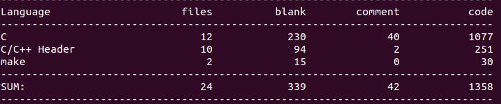

**Now**

- v1.0正在实现

    - 通信模型:
    
        - 包头 + 包体 (解决缺包,粘包问题)

    - 服务器端特性:

        - 添加Timer定时器,定时关闭非活动连接

            - 高效的时间轮结构

        - 并发模型

            - 非阻塞I/O

            - epoll边缘触发模式 (ET)

        - 线程池操作及其同步互斥管理

        - 使用有限状态机管理连接中的收包状态